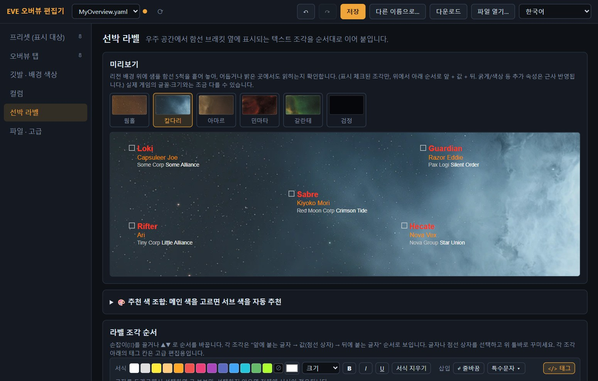
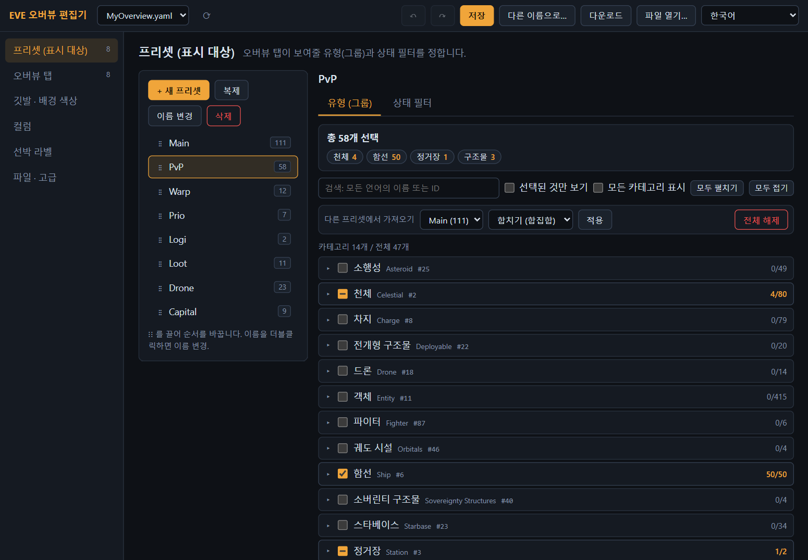
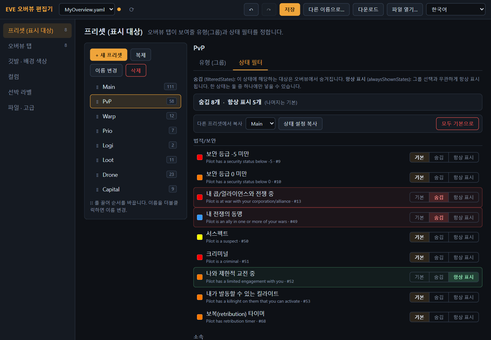
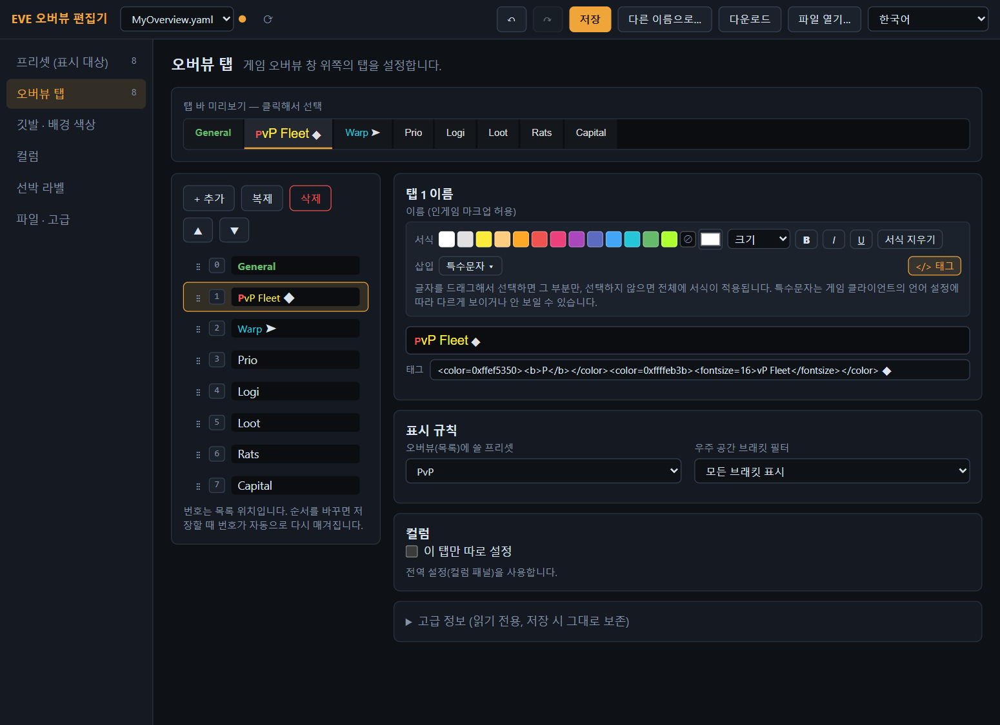
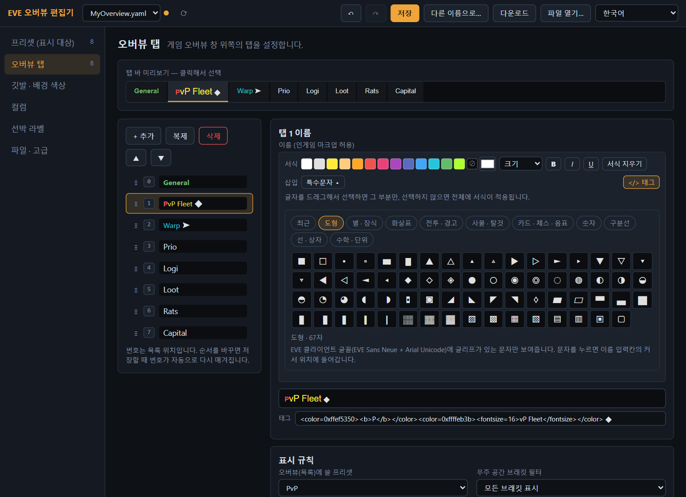
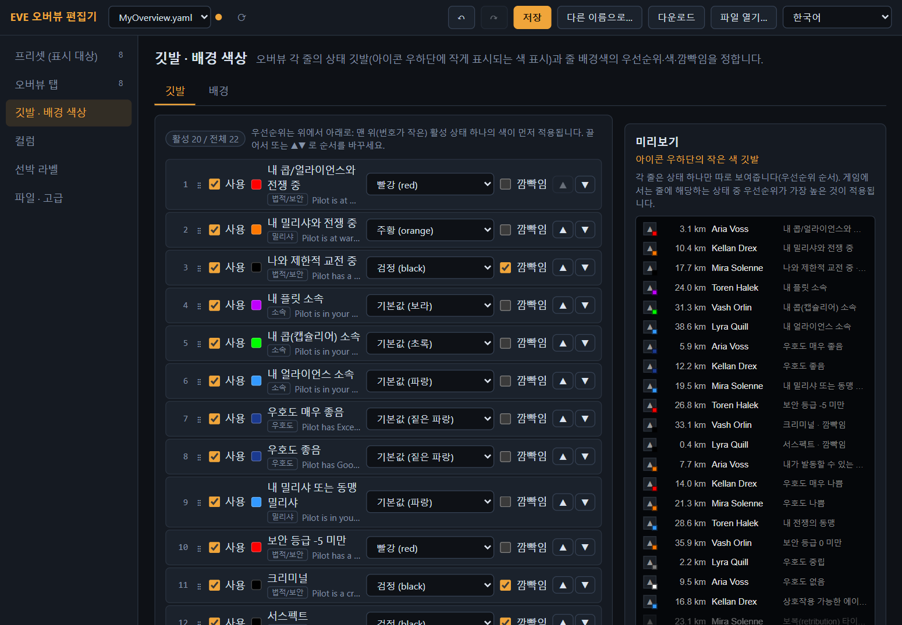
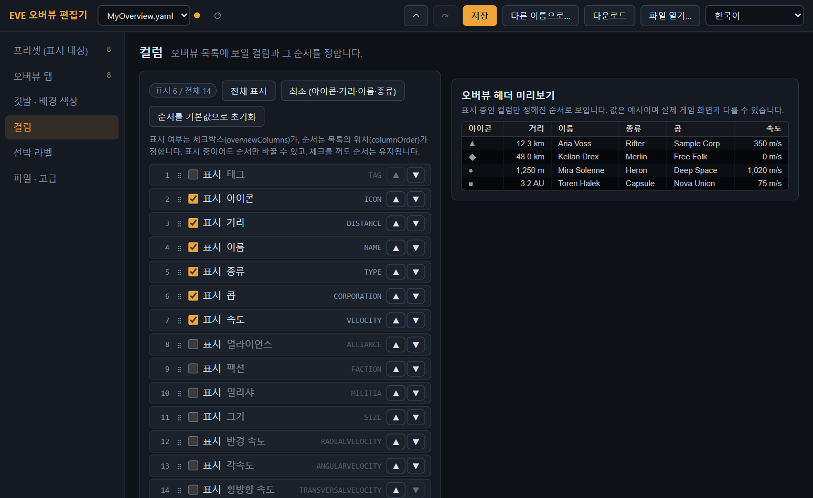
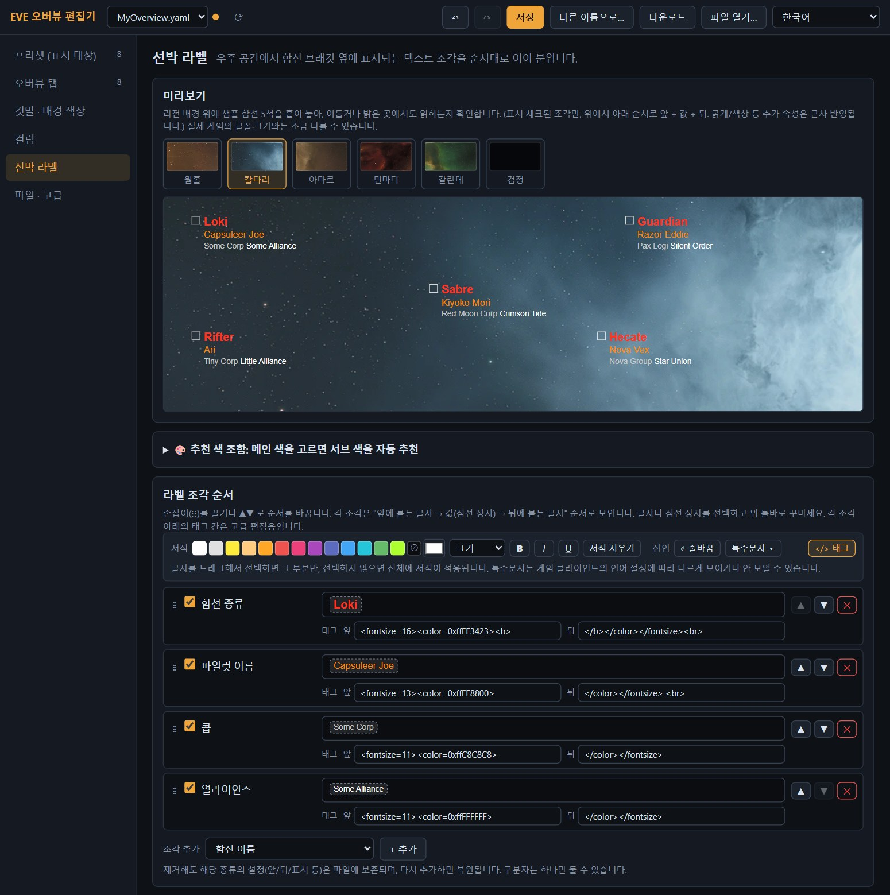
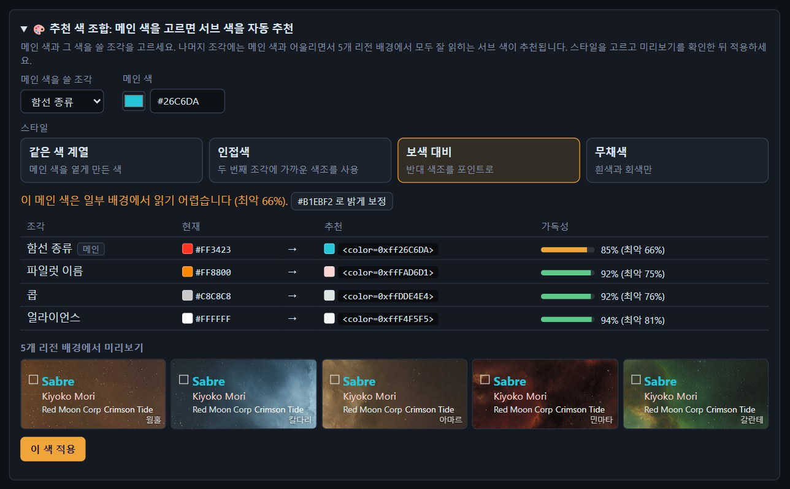
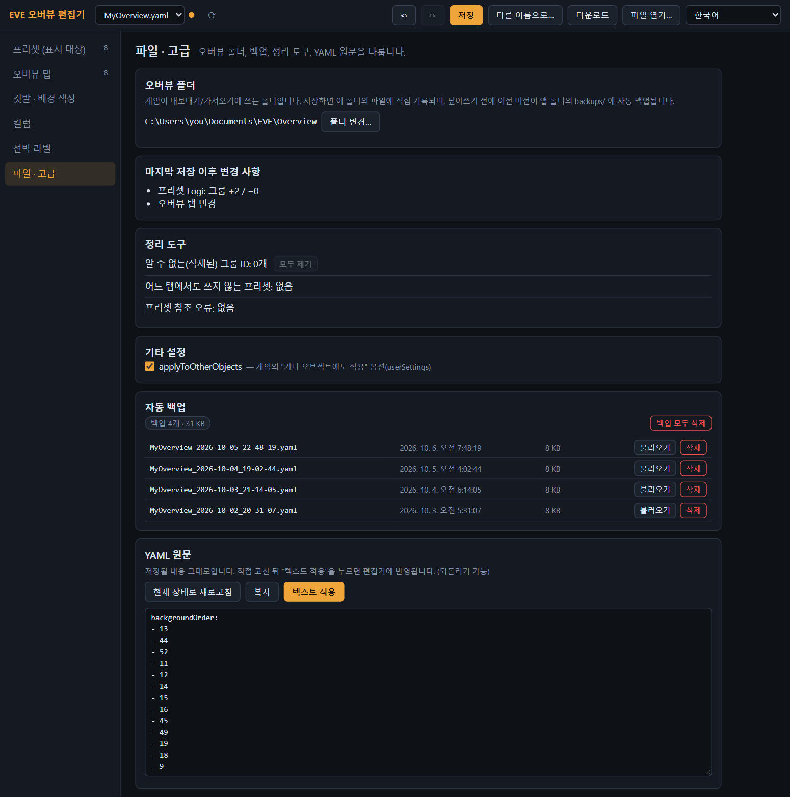

# EVE 오버뷰 편집기

[English](README.md) · **한국어**

EVE Online 의 오버뷰 설정을 게임 안에서 하려면 탭도 많고 목록도 아주 깁니다. **EVE 오버뷰 편집기**는 그 작업을 브라우저에서, 실시간 미리보기와 함께 할 수 있게 해 줍니다. 보여줄 대상 고르기, 탭 이름 꾸미기, 깃발·배경 색상 정하기, 실제 리전 배경 위에서 선박 라벨 가독성 확인까지 한 곳에서 합니다.

게임이 직접 내보내는 YAML 파일을 편집하는 방식이라 게임 클라이언트는 전혀 건드리지 않습니다. 내 PC 안에서만 동작하며 인터넷으로 아무것도 보내지 않습니다.

> 비공식 무료 팬 도구이며 CCP Games 와 무관합니다. [CCP notice](#ccp-notice) 참고.

▶ **[영상 튜토리얼](https://youtu.be/WOjL-5-N6YE)** (4분, 영어 해설, 한국어·영어·일본어·러시아어·중국어 자막).

## 목차

- [할 수 있는 일](#할-수-있는-일)
- [준비물](#준비물)
- [설치와 실행](#설치와-실행)
- [빠른 시작: 전체 작업 흐름](#빠른-시작-전체-작업-흐름)
- [패널별 설명](#패널별-설명)
- [저장, 백업, 되돌리기](#저장-백업-되돌리기)
- [활용 예시](#활용-예시)
- [문제 해결](#문제-해결)
- [자주 묻는 질문](#자주-묻는-질문)
- [개발자용 안내](#개발자용-안내)
- [CCP notice](#ccp-notice)

## 할 수 있는 일

| 패널 | 편집하는 것 |
|---|---|
| **프리셋 (표시 대상)** | 오버뷰 탭이 보여줄 유형(그룹)과 상태 필터 |
| **오버뷰 탭** | 탭 이름(색상·크기·굵게/기울임/밑줄·특수문자), 탭이 쓰는 프리셋, 탭별 컬럼 |
| **깃발 · 배경 색상** | 아이콘 우하단의 작은 깃발과 줄 배경의 우선순위·색·깜빡임 |
| **컬럼** | 오버뷰에 보일 컬럼과 순서 |
| **선박 라벨** | 우주 공간 브래킷 옆 글자 조각의 순서·서식, 그리고 색 추천 도우미 |
| **파일 · 고급** | 오버뷰 폴더, 변경 요약, 정리 도구, 백업, YAML 원문 |

마음 놓고 만져 보셔도 됩니다. **저장**을 누르기 전에는 아무것도 기록되지 않고, 모든 편집은 되돌릴 수 있으며, 저장할 때마다 이전 버전이 먼저 백업됩니다. 편집기가 모르는 설정은 원본 그대로 보존됩니다.

화면 언어는 **English · 한국어 · 日本語 · Русский · 中文** 을 지원합니다. 기본은 브라우저 언어이고, 상단 바의 언어 선택으로 바꿀 수 있습니다.

## 준비물

- 바로 실행되는 내려받기 파일(exe 하나, 또는 zip)은 **Windows 10 / 11** 용이며, 둘 다 Node.js 가 함께 들어 있어 Node.js 를 **따로 설치하지 않아도** 됩니다.
- **macOS**, **Linux** 이거나 소스 코드로 실행하려면 **[Node.js](https://nodejs.org) 18 이상**("LTS" 버전이면 충분합니다)이 필요합니다. `start.bat` 실행 파일만 Windows 전용이고, 다른 운영체제에서는 명령어 한 줄로 서버를 시작합니다.
- `npm install` 도, 사용 중 인터넷 연결도 필요 없습니다.
- 최신 웹 브라우저 (Chrome, Edge, Firefox, Safari).
- 설정을 내보내고 다시 가져올 EVE Online 클라이언트.

## 설치와 실행

### 방법 A: Windows, 파일 하나 (권장)

1. [최신 릴리스](https://github.com/LanturnHouse/eve-overview-editor/releases/latest) 페이지에서 **`EVE-Overview-Editor.exe`** (약 95 MB, 편집기와 Node.js 가 들어 있음)를 내려받습니다.
2. 전용 폴더(예: `문서\EVE-Overview-Editor`)에 두고 더블클릭합니다. 콘솔 창이 뜨고 브라우저에서 `http://localhost:5173` 이 열립니다.
3. **편집하는 동안 콘솔 창은 닫지 마세요.** 끝내려면 창을 닫습니다.

처음 실행할 때 Windows 가 "PC 를 보호했습니다" 라고 할 수 있습니다. 파일에 코드 서명이 없기 때문입니다. 내려받은 파일을 믿는다면 **추가 정보 → 실행**을 누르세요. 릴리스 페이지의 `SHA256SUMS.txt` 와 비교해 파일을 확인할 수도 있습니다.

설정(폴더 지정, 자동 백업)은 프로그램이 `.exe` 옆에 만드는 `EVE-Overview-Editor-data` 폴더에 저장됩니다. **업데이트:** `.exe` 를 새 파일로 바꾸면 되고, 데이터 폴더는 그대로 남습니다.

### 방법 B: Windows, `start.bat` 이 든 zip

파일 하나보다 폴더가 편하다면 같은 릴리스 페이지에서 **`EVE-Overview-Editor-…-windows-x64.zip`** (약 40 MB)을 내려받아 우클릭 → **모두 압축 풀기…** 로 바탕화면이나 문서 같은 일반 폴더에 풀고(*Program Files* 는 피하세요) **`start.bat`** 을 더블클릭하세요. 콘솔 창이 뜨고, 2초쯤 뒤 브라우저에서 `http://localhost:5173` 이 열립니다. 편집하는 동안 콘솔 창은 닫지 마세요. 끝내려면 창을 닫습니다.

여기서도 Windows 보안 경고("Windows의 PC 보호" 또는 "파일 열기 - 보안 경고")가 뜰 수 있으니, 내려받은 파일을 믿는다면 **추가 정보 → 실행**(또는 **실행**)을 누르세요. 함께 들어 있는 `runtime\node.exe` 는 수정하지 않은 공식 Node.js 입니다.

**업데이트:** 새 버전을 새 폴더에 푸세요. 백업과 폴더 설정을 이어 쓰려면 예전 폴더의 `backups\` 와 `config.json` 을 새 폴더로 복사하세요.

### 방법 C: 소스 코드로 (모든 운영체제, Node.js 18+ 필요)

1. **Node.js 설치**: [nodejs.org](https://nodejs.org) 에서 받아 기본 설정으로 설치합니다. 터미널에서 `node -v` 를 입력해 `v18` 이상이 나오면 됩니다.
2. **편집기 내려받기**: [GitHub 페이지](https://github.com/LanturnHouse/eve-overview-editor)에서 초록색 **Code** 버튼 → **Download ZIP** 을 누르고, 원하는 곳(예: `C:\Tools\eve-overview-editor`)에 압축을 풉니다. git 을 쓴다면 `git clone https://github.com/LanturnHouse/eve-overview-editor.git`.
3. **실행**
   - **Windows**: **`start.bat`** 을 더블클릭합니다(방법 B 와 같은 실행 파일이며, 설치된 Node.js 를 씁니다).
   - **macOS / Linux**: 폴더에서 터미널을 열고 `node server.mjs` 를 실행한 뒤, 브라우저에서 `http://localhost:5173` 을 엽니다.
4. **편집하는 동안 콘솔 창은 닫지 마세요.** 끝내려면 창을 닫거나 `Ctrl+C` 를 누릅니다.

### 다른 포트 쓰기

다른 포트를 쓰려면 시작 전에 `PORT` 를 지정합니다. 예: `PORT=5200 node server.mjs` (macOS / Linux), `set PORT=5200 && node server.mjs` (Windows 명령 프롬프트), `$env:PORT=5200; node server.mjs` (PowerShell). `start.bat` 은 항상 5173 포트를 열기 때문에 이 경우에는 주소를 직접 입력하세요.

exe 하나(방법 A)라면 그 폴더에서 명령 프롬프트를 열어 `set PORT=5200 && EVE-Overview-Editor.exe` 를 실행하세요.

zip(방법 B)에는 PATH 에 `node` 가 없으므로, 압축을 푼 폴더에서 연 명령 프롬프트에서 함께 들어 있는 런타임을 쓰세요: `set PORT=5200 && runtime\node.exe server.mjs`.

## 빠른 시작: 전체 작업 흐름

편집기가 바꾸는 것은 실행 중인 게임이 아니라 **파일**입니다. 그래서 흐름은 "게임에서 내보내기 → 편집기에서 편집 → 게임으로 가져오기" 입니다.

### 1. 게임에서 설정 내보내기

1. 오버뷰 창의 메뉴(오른쪽 위의 **⋮**)를 열고 **Open Overview Settings** 를 고릅니다. *Esc → 단축키 → 창* 에서 지정한 단축키를 써도 됩니다.
2. 오버뷰 설정 창 오른쪽 위의 **⋮ 옵션 메뉴**에서 **Export Overview Settings** 를 고르고, 파일 이름을 입력한 뒤 **Export** 를 누릅니다. 저장된 파일 경로가 안내 창으로 나옵니다. (예전 안내에는 *Misc* 탭 아래쪽의 가져오기/내보내기 버튼이 나오는데, 위치는 클라이언트 버전에 따라 다릅니다. 메뉴 이름은 게임 언어에 따라 다를 수 있습니다.)
3. 게임이 `Documents\EVE\Overview` 폴더에 `.yaml` 파일을 저장합니다. (Windows: `%userprofile%\Documents\EVE\Overview`, macOS: `~/Documents/EVE/Overview`)

### 2. 편집기에서 열기

편집기가 이 폴더를 찾아 파일 하나를 자동으로 엽니다(`1.yaml` 이 있으면 그것을, 없으면 첫 번째 파일). 파일이 여러 개면 왼쪽 위 드롭다운에서 고릅니다. YAML 파일을 창에 끌어다 놓거나 **파일 열기…** 로 열 수도 있습니다.

폴더를 찾지 못하면 알림이 뜹니다. **파일 · 고급 → 폴더 변경…** 에서 지정하세요(이 패널은 열린 파일이 없어도 열립니다). 폴더에 파일이 있으면 첫 번째 파일이 자동으로 열립니다.

### 3. 편집

왼쪽의 여섯 패널을 사용합니다. 바꾸는 즉시 미리보기에 반영됩니다. 파일 이름 옆의 주황색 점은 저장하지 않은 변경 사항이 있다는 표시입니다.

### 4. 저장

**저장**(또는 `Ctrl+S`)을 누르면 오버뷰 폴더의 파일이 덮어써지고, 그 전에 이전 버전이 `backups/` 폴더에 복사됩니다. 화면 아래 알림에 백업 파일 이름이 나옵니다.

### 5. 게임으로 가져오기

오버뷰 설정 창을 다시 열고 **⋮ 옵션 메뉴**에서 **Import Settings** 를 고른 뒤, 방금 저장한 파일을 선택하고 **Import** 를 누릅니다. 새 탭, 색, 라벨이 바로 적용됩니다. 게임을 다시 시작할 필요는 없습니다.

> 게임은 폴더를 감시하지 않습니다. 변경 사항은 파일을 **가져오기** 했을 때만 게임에 반영됩니다.

## 패널별 설명

### 상단 바

| 요소 | 역할 |
|---|---|
| 파일 드롭다운 | 오버뷰 폴더의 YAML 파일. 바꿀 때 저장하지 않은 변경 사항이 있으면 먼저 물어봅니다. |
| ⟳ | 파일 목록 새로고침 (게임에서 다시 내보낸 뒤 등). |
| 주황색 점 | 저장하지 않은 변경 사항이 있음. |
| ↶ / ↷ | 되돌리기 / 다시 실행 (`Ctrl+Z` / `Ctrl+Y`). 약 200단계. |
| **저장** | 열려 있는 파일을 오버뷰 폴더에 기록 (`Ctrl+S`). |
| **다른 이름으로…** | 현재 상태를 오버뷰 폴더에 새 파일 이름으로 기록. |
| **다운로드** | 현재 상태를 브라우저로 내려받기. 오버뷰 폴더에는 아무것도 기록하지 않습니다. |
| **파일 열기…** | PC 어디에 있든 YAML 파일을 엽니다. (저장하면 오버뷰 폴더에 같은 이름으로 기록됩니다.) |
| 언어 | 자동 (브라우저 설정), English, 한국어, 日本語, Русский, 中文. |

### 프리셋 (표시 대상)

**프리셋**은 *오버뷰 탭이 무엇을 보여줄지*를 저장한 목록입니다. 오브젝트 유형(그룹)과 몇 가지 상태 필터로 이루어져 있고, 오버뷰 탭은 목록에 쓸 프리셋 하나를, 필요하면 우주 공간 브래킷에 쓸 프리셋 하나를 더 가리킵니다([오버뷰 탭](#오버뷰-탭)의 *표시 규칙* 참고).

**왼쪽: 프리셋 목록.** 각 프리셋의 숫자는 들어 있는 그룹 수입니다.
- **+ 새 프리셋**, **복제**, **이름 변경**(이름을 더블클릭해도 됩니다), **삭제**. 이름을 바꾸면 그 프리셋을 쓰는 모든 탭의 참조도 함께 바뀝니다. 삭제할 때 아직 쓰는 탭이 있으면 알려 줍니다.
- **⋮⋮** 손잡이를 끌어 순서를 바꿉니다.

**유형 (그룹) 탭.** 프리셋이 보여줄 대상을 고릅니다.
- 그룹을 하나씩 체크하거나 **카테고리**째로 체크합니다(일부만 선택되면 체크박스에 대시가 표시됩니다). 위쪽의 칩(예: `함선 50`)은 선택 현황이고, 누르면 그 카테고리로 이동합니다.
- **검색**: 5개 언어 중 어느 언어의 이름이든, 또는 그룹 ID 로 찾습니다.
- **선택된 것만 보기**, **모두 펼치기 / 모두 접기**. 기본으로는 오버뷰에서 의미 있는 카테고리(와 프리셋이 이미 쓰고 있는 카테고리)만 나열하고, **모든 카테고리 표시**를 체크하면 전부 보입니다.
- **다른 프리셋에서 가져오기**: 다른 프리셋의 그룹을 이 프리셋에 *합치기 (합집합)*, *교집합만 남기기*, *빼기 (차집합)*, *완전히 교체* 중 하나로 반영합니다.
- **전체 해제**: 선택을 모두 지웁니다(되돌리기 가능).
- *알 수 없는 그룹*은 현재 게임 데이터에 없는 ID 입니다. 남겨 두어도, 제거해도 됩니다.

**상태 필터 탭.** 각 상태(예: "내 콥/얼라이언스와 전쟁 중", "우호도 매우 좋음", "크리미널", "내 플릿 소속")마다 고릅니다.
- **기본**: 특별한 처리 없음,
- **숨김**: 이 상태의 대상은 오버뷰에서 숨김,
- **항상 표시**: 그룹 선택과 무관하게 항상 표시.

한 상태는 둘 중 한쪽에만 넣을 수 있고, 충돌하면 편집기가 경고합니다. **다른 프리셋에서 복사**와 **모두 기본으로**가 있어 편합니다.

### 오버뷰 탭

게임 오버뷰 창 위쪽의 탭입니다.

- 맨 위의 **탭 바 미리보기**가 꾸민 탭 이름을 그대로 보여 줍니다. 탭을 누르면 선택됩니다.
- **+ 추가**, **복제**, **삭제**, **▲ ▼**(또는 **⋮⋮** 끌기)로 목록을 관리합니다. 번호는 게임에서의 탭 위치이며, 저장할 때 자동으로 다시 매겨집니다.
- **이름.** *보이는 모습 그대로* 나오는 입력칸에 입력합니다. 위의 툴바로 꾸밉니다.
  - 색상 견본(원하는 색을 고르는 색상 선택기와 색 해제 버튼 포함),
  - **크기**, **B**(굵게), **I**(기울임), **U**(밑줄), **서식 지우기**,
  - **삽입 → 특수문자**.
  - 글자를 드래그해 선택하면 그 부분만, 아무것도 선택하지 않으면 이름 전체에 서식이 적용됩니다.
- **태그.** 이름 아래의 작은 입력칸은 게임이 실제로 저장하는 EVE 마크업입니다. 예: `<color=0xffef5350><b>P</b></color>`. 고급 사용자용이며, 여기를 고치면 위의 꾸며진 입력칸이 바뀌고 반대도 마찬가지입니다. **`</> 태그`** 버튼으로 보이기/숨기기를 합니다. 편집기가 해석하지 못하는 마크업은 그대로 보존됩니다.
- **특수문자.** 선택창에는 EVE 클라이언트 글꼴(EVE Sans Neue + Arial Unicode)에 실제로 글리프가 있는 문자만 나옵니다. 그래서 게임에서 빈 네모로 깨지지 않습니다. 분류(또는 *최근*)를 고르고 문자를 누르면 커서 위치에 들어갑니다.

- **표시 규칙.** *오버뷰(목록)에 쓸 프리셋*은 탭이 무엇을 나열할지, *우주 공간 브래킷 필터*는 우주에서 어떤 브래킷을 보일지(*모든 브래킷 표시* 또는 프리셋)를 정합니다.
- **컬럼.** **이 탭만 따로 설정**을 체크하면 이 탭만의 컬럼 목록을 쓰고, 아니면 전역 [컬럼](#컬럼) 설정을 따릅니다.

### 깃발 · 배경 색상

오버뷰의 각 줄은 아이콘 우하단에 작은 색 **깃발**을, 줄 전체에 색 **배경**을 가질 수 있습니다. 둘 다 *상태*(전쟁 중, 내 플릿, 우호도 단계, 크리미널, 서스펙트 등)의 우선순위 목록으로 결정됩니다.

- 위쪽 탭으로 **깃발**과 **배경**을 오갑니다.
- 상태마다 **사용**을 체크하고, **색**을 고르고(*기본값*은 게임이 그 상태에 정해 둔 색), 깜빡이게 하려면 **깜빡임**을 체크합니다.
- **순서가 곧 우선순위입니다.** 줄에 해당하는 상태 중 사용 중인 맨 위의 것이 적용되므로, 중요한 상태를 위로 올리세요. 손잡이를 끌거나 **▲ ▼** 를 씁니다.
- 오른쪽 **미리보기**는 상태마다 한 줄씩 우선순위 순서로 보여 줍니다. 색 이름의 미리보기 색은 실제 게임 색에 가까운 근사값입니다.

### 컬럼

오버뷰 목록에 보일 컬럼과 순서를 정합니다.

- 보일 컬럼마다 **표시**를 체크하고, **▲ ▼** 나 끌기로 순서를 바꿉니다. 체크를 꺼도 순서는 유지됩니다.
- **전체 표시**, **최소 (아이콘·거리·이름·종류)**, **순서를 기본값으로 초기화**는 원클릭 프리셋입니다.
- 오른쪽의 헤더 미리보기가 선택에 따라 바뀝니다. 안의 값은 예시일 뿐입니다.
- 여기 설정은 자체 컬럼 설정이 없는 탭의 기본값입니다(탭별 컬럼은 *오버뷰 탭*에서 정합니다).

### 선박 라벨

우주 공간에서 함선 브래킷 옆에 표시되는 글자입니다. *파일럿 이름*, *함선 종류*, *함선 이름*, *콥*, *얼라이언스*, *팩션*, *밀리샤* 같은 **조각**과 선택적인 *구분자*를 이어 붙여 만듭니다.

- **미리보기.** 실제 리전 배경 위에 샘플 함선 5척을 놓아 어둡거나 밝은 곳에서의 가독성을 확인합니다. **웜홀, 칼다리, 아마르, 민마타, 갈란테, 검정** 배경을 바꿔 볼 수 있습니다.
- **라벨 조각 순서.** 체크박스는 조각 표시 여부, **▲ ▼** 와 **⋮⋮** 손잡이는 순서 변경, **✕** 는 목록에서 제거입니다(제거해도 그 조각의 설정은 파일에 남아 있고, 다시 추가하면 복원됩니다). 맨 아래의 **+ 추가**로 조각을 더합니다.
- **조각 꾸미기.** 각 조각은 *앞에 붙는 글자 → 값 → 뒤에 붙는 글자* 순서로 보입니다. 값은 점선 상자이며 게임이 채워 넣는 실제 이름/종류를 뜻합니다. 점선 상자를 눌러 툴바로 값 자체를 꾸미거나, 앞뒤 글자를 선택해 꾸밉니다. 탭 이름과 같은 툴바와 **태그** 입력칸을 씁니다.
- 툴바의 **줄바꿈**은 다음 조각을 새 줄에 놓습니다.

**추천 색 조합 도우미.** 색을 일일이 고르기 싫다면 **추천 색 조합: 메인 색을 고르면 서브 색을 자동 추천**을 펼치세요.

1. **메인 색**을 쓸 조각을 고르고 색을 정합니다(16진수 코드를 직접 입력해도 됩니다). 이 도우미는 *함선 종류*, *파일럿 이름*, *콥*, *얼라이언스* 조각에만 적용되며, 이 중 2개 이상이 라벨 목록에 있어야 합니다. 나머지 조각(함선 이름, 팩션, 밀리샤)은 바뀌지 않습니다.
2. **스타일**을 고릅니다: *같은 색 계열*(옅은 색조), *인접색*, *보색 대비*(반대 색조를 포인트로), *무채색*(흰색과 회색).
3. 표에 조각별 현재 색, 태그 문자열이 함께 나오는 **추천** 색, 그리고 **가독성**이 나옵니다. 가독성은 5개 리전 배경 중 그 색이 또렷하게 읽히는(대비 3 이상) 배경의 비율이며, 평균과 최악의 경우를 보여 줍니다. 메인 색이 읽기 어려우면 **#… 로 밝게 보정** 버튼이 고칠 색을 제안합니다.
4. 5개 배경의 작은 미리보기를 확인하고 **이 색 적용**을 누릅니다. 되돌리기 할 수 있습니다.

### 파일 · 고급

- **오버뷰 폴더.** 게임이 내보내기/가져오기에 쓰는 폴더입니다. **폴더 변경…** 에서 다른 전체 경로를 입력합니다(선택은 서버 옆의 `config.json` 에, `.exe` 를 쓰면 `EVE-Overview-Editor-data` 폴더에 기억됩니다).
- **마지막 저장 이후 변경 사항.** 무엇을 바꿨는지(프리셋, 탭, 깃발·배경, 컬럼, 라벨) 읽기 쉽게 요약합니다.
- **정리 도구.** 더는 존재하지 않는 그룹 ID 제거, 어느 탭도 쓰지 않는 프리셋과 없는 프리셋을 가리키는 탭 찾기.
- **기타 설정.** 게임의 *기타 오브젝트에도 적용* 옵션.
- **자동 백업.** 저장으로 파일을 덮어쓸 때마다 이전 버전이 여기에 쌓입니다. **불러오기**는 백업을 새 저장 안 된 파일로 엽니다(복원하려면 **다른 이름으로…** 에서 원래 파일 이름을 입력하세요. 덮어쓰기 전에 편집기가 물어봅니다). **삭제**는 하나를, **백업 모두 삭제**는 전부 지웁니다.
- **YAML 원문.** 저장될 내용 그대로입니다. 직접 고치고 **텍스트 적용**을 누를 수 있으며, 오류가 있으면 아무것도 바꾸지 않고 알려 줍니다.

## 저장, 백업, 되돌리기

- **저장을 누르기 전에는 아무것도 기록되지 않습니다.** 저장하지 않은 채 브라우저 탭을 닫으려 하면 경고가 뜹니다.
- **저장**은 오버뷰 폴더의 열린 파일을 덮어씁니다. 그 전에 기존 파일이 편집기 폴더의 `backups/<이름>_<날짜>_<시간>.yaml` 로 복사됩니다(`.exe` 를 쓰면 `EVE-Overview-Editor-data\backups`). 백업은 *파일 · 고급*에서 지우기 전까지 계속 쌓입니다.
- **다른 이름으로…** 는 입력한 파일 이름으로 기록합니다(이미 있는 다른 파일이면 덮어쓰기 전에 물어보고, 지금 열려 있는 파일의 이름을 쓰면 **저장**과 같습니다). **다운로드**는 대신 브라우저로 사본을 내려받습니다.
- **되돌리기 / 다시 실행**은 모든 패널에서 동작합니다(`Ctrl+Z` / `Ctrl+Y` 또는 ↶ ↷ 버튼). 검색칸이나 태그 입력칸 같은 일반 입력칸 안에서는 브라우저 자체의 글자 되돌리기가 쓰입니다.
- **줄바꿈 형식:** 저장으로 기존 파일을 덮어쓸 때는 그 파일의 줄바꿈 형식이 유지되고(CRLF 는 CRLF 그대로), 새 파일은 Windows 에서 CRLF 로 만들어지며, **다운로드**는 항상 LF 입니다. 편집기가 건드리지 않은 내용은 그대로 다시 기록됩니다.
- 예전 버전으로 돌아가려면 **파일 · 고급 → 자동 백업 → 불러오기** 후 원래 파일 이름으로 **다른 이름으로…** 저장하세요.

## 활용 예시

**전자전·인터딕션·커맨드쉽만 보는 탭 만들기**
1. *프리셋* → **+ 새 프리셋** → 이름을 `EWAR` 로 합니다.
2. **유형 (그룹)** 탭에서 예를 들어 *전자전 프리깃(Electronic Attack Ship)*, *포스 리콘 크루저*, *컴뱃 리콘 크루저*, *인터딕터 크루저(Heavy Interdiction Cruiser)*, *인터딕터*, *커맨드쉽*, *커맨드 디스트로이어* 를 검색해 체크합니다.
3. *오버뷰 탭* → **+ 추가**. 탭 이름을 입력하고 색을 입히고 선택창에서 특수문자를 넣습니다. **표시 규칙**의 *오버뷰(목록)에 쓸 프리셋*을 `EWAR` 로 지정합니다.
4. **저장**하고 게임에서 가져오기 합니다.

**전쟁 중인 대상을 놓치지 않기**
*깃발 · 배경 색상* → **배경** → *내 콥/얼라이언스와 전쟁 중* → **사용** 체크, 색 **빨강**, **깜빡임** 체크 후 목록 맨 위로 올립니다.

**어떤 배경에서도 잘 읽히는 선박 라벨**
*선박 라벨* → 색 추천 도우미를 펼쳐 *함선 종류*에 밝은 **메인 색**을 주고, 스타일을 고른 뒤 가독성 열을 확인합니다. **이 색 적용**을 누르고 미리보기에서 배경별로 다시 확인하세요.

**설정을 공유하거나 다른 PC 로 옮기기**
오버뷰 폴더의 `.yaml` 파일을 복사해 가거나(또는 **다운로드**) 다른 PC·캐릭터에서 가져오기 하면 됩니다.

## 문제 해결

| 증상 | 해결 |
|---|---|
| `start.bat` 이 *Node.js is required* 라고 함 | 소스 코드로 실행하고 있어서 Node.js 가 필요한 경우입니다. [릴리스 페이지](https://github.com/LanturnHouse/eve-overview-editor/releases/latest)에서 바로 실행되는 exe 나 zip 을 받거나(방법 A 또는 B), [nodejs.org](https://nodejs.org) 에서 Node.js 를 설치하고 창을 닫은 뒤 `start.bat` 을 다시 실행하세요. |
| Windows 가 *Windows의 PC 보호* / *파일 열기 - 보안 경고* 를 띄움 | 파일에 코드 서명이 없어서 나오는 경고입니다. 내려받은 파일을 믿는다면 **추가 정보 → 실행**(또는 **실행**)을 누르세요. |
| `.exe` 의 콘솔 창이 메시지를 띄우고 닫힘 | 편집기가 이미 실행 중이면 다시 시작해도 브라우저에서 그 편집기를 열어 주고 몇 초 뒤 닫힙니다. 문제가 생긴 경우에는 메시지를 읽을 수 있게 창이 15초쯤 남아 있습니다. |
| *Port 5173 is already in use* | 편집기가 이미 실행 중일 가능성이 큽니다. `http://localhost:5173` 을 여세요. 또는 다른 포트로 시작합니다([설치와 실행](#설치와-실행) 참고). |
| 브라우저가 자동으로 열리지 않음 | `http://localhost:5173` 을 직접 여세요. |
| *오버뷰 폴더를 찾지 못했습니다* | 게임에서 먼저 한 번 내보내거나, **파일 · 고급 → 폴더 변경…** 에서 전체 경로(예: `C:\Users\내이름\Documents\EVE\Overview`)를 입력하세요. 문서 폴더가 OneDrive 에 있어도 편집기가 그 위치를 함께 확인합니다. |
| 파일 목록에 *(YAML 파일 없음)* | 그 폴더에 `.yaml` 파일이 아직 없습니다. 게임에서 내보낸 뒤 ⟳ 를 누르세요(열린 파일이 아직 없으면 첫 번째 파일을 자동으로 엽니다). |
| *오버뷰 YAML 형식이 아닙니다* | 게임의 **오버뷰 설정 내보내기**로 만든 파일을 쓰세요. |
| 게임에 변경 사항이 안 보임 | **저장**(주황색 점이 사라졌는지 확인)한 뒤 게임에서 파일을 **가져오기** 하세요. 게임은 폴더를 스스로 읽지 않습니다. |
| 게임에서 글자가 빈 네모로 보임 | 키보드로 직접 입력한 문자는 EVE 글꼴에 없을 수 있습니다. 검증된 문자만 나오는 편집기의 특수문자 선택창을 쓰세요. |
| 미리보기와 게임 색이 조금 다름 | 미리보기는 근사값입니다. 최종 결과는 게임에서 확인하세요. |
| 저장한 파일이 이상함 | **파일 · 고급 → 자동 백업**에서 이전 버전을 복원하세요. |

## 자주 묻는 질문

**Node.js 를 꼭 설치해야 하나요?** [릴리스 페이지](https://github.com/LanturnHouse/eve-overview-editor/releases/latest)의 Windows 용 내려받기 파일(exe, zip)에는 각각 Node.js 가 함께 들어 있습니다. 소스 코드로 실행하거나 macOS / Linux 에서만 Node.js 가 필요합니다. 어느 쪽이든 설치 프로그램은 없습니다. 지우려면 `.exe`(와 `EVE-Overview-Editor-data` 폴더) 또는 압축을 푼 폴더를 삭제하면 됩니다.

**내 설정이 망가질 걱정은 없나요?** 없습니다. 저장할 때마다 먼저 백업하고, 모르는 설정은 그대로 보존하며, 저장 전에 *YAML 원문*에서 정확한 결과를 확인할 수 있습니다.

**게임을 바꾸거나 게임과 통신하나요?** 아니요. 게임이 내보내고 가져오는 YAML 파일만 편집합니다. 클라이언트나 게임 네트워크 통신에는 전혀 손대지 않습니다.

**인터넷이 필요한가요?** 아니요. 필요한 것은 모두 내려받은 파일 안에 있습니다. 그룹/카테고리 이름은 공개 ESI 데이터를 앱에 내장한 것입니다.

**내 데이터가 어디로 전송되나요?** 어디로도 가지 않습니다. 서버는 `127.0.0.1` 에서만 응답하고, 다른 호스트 이름으로 온 요청과 편집기 화면이 아닌 곳에서 오는 변경 요청(저장, 삭제, 폴더 변경)은 거부하므로 다른 웹사이트가 내 파일을 바꿀 수 없습니다. 인터넷으로는 아무것도 전송하지 않습니다.

**macOS 나 Linux 에서도 되나요?** 서버가 순수 Node.js 라서 `node server.mjs` 로 실행하면 됩니다. Windows 전용인 것은 `start.bat` 뿐입니다. 기본 오버뷰 폴더는 `~/Documents/EVE/Overview` 이며, 다른 곳이라면 *폴더 변경…* 을 쓰세요.

**어떤 파일을 읽나요?** 현재 YAML 형식의 오버뷰 내보내기 파일입니다. 예전 XML 형식은 지원하지 않으니, 게임에서 YAML 로 다시 내보내세요.

**여러 파일을 편집할 수 있나요?** 네. 파일 드롭다운에서 고르면 됩니다. 저장하지 않은 변경 사항이 있으면 파일을 바꾸기 전에 먼저 물어봅니다.

**게임 안의 설정도 계속 쓸 수 있나요?** 물론입니다. 게임의 현재 상태에서 이어서 하려면 다시 내보내면 됩니다.

## 개발자용 안내

- 빌드 단계도 의존성도 없습니다. 서버는 `server.mjs`, 앱은 `public/` 의 순수 ES 모듈이고, [js-yaml](https://github.com/nodeca/js-yaml) 은 `public/vendor/` 에 내장되어 있습니다.
- 번역은 `public/js/locales/` 에 있습니다(영어·한국어·일본어·러시아어·중국어). 개선 PR 을 환영합니다. 일본어·러시아어·중국어의 상태/컬럼 이름은 번역이라 게임의 공식 용어와 다를 수 있습니다.
- `node tools/build-data.mjs` 는 ESI 에서 그룹/카테고리 이름을 다시 받아 `public/data/groups.json` 에 저장합니다.
- `node tools/roundtrip.mjs <파일>` 은 파일을 읽고 다시 쓴 결과가 원본과 동일한지 비교합니다.
- `node tools/make-release.mjs` 는 `dist/` 에 Windows 휴대용 zip 을 만듭니다: 앱, 스크립트를 실행한 Node.js 런타임(`runtime\node.exe` 로 복사), 간단한 안내문.
- `node tools/make-exe.mjs` 는 Node.js 의 [단일 실행 파일(SEA)](https://nodejs.org/api/single-executable-applications.html) 기능으로 `dist/EVE-Overview-Editor.exe` 를 만들고(Node.js 22 이상 필요, `npx` 로 [postject](https://github.com/nodejs/postject) 를 받아 씁니다) 한 번 실행해서 동작을 확인합니다. `server.mjs` 는 exe 안에서 실행 중임을 알아채고 `public/` 을 exe 안에서 읽으며, 설정은 exe 옆의 `EVE-Overview-Editor-data` 에 저장합니다.
- `v1.0.0` 같은 태그를 푸시하면 `.github/workflows/release.yml` 이 공식 Node.js 로 두 파일을 만들어 `SHA256SUMS.txt` 와 함께 GitHub Release 에 올립니다.
- 상태 ID 이름은 [kormat/eve-overview-tool](https://github.com/kormat/eve-overview-tool) 및 [Z-S Overview Customizer](https://github.com/Arziel1992/Z-S-Overview-Customizer) 의 공개 자료를 참고했습니다. 색 이름의 미리보기 색은 근사값입니다.

## CCP notice

This is an unofficial, free, non-commercial fan tool. This material is used with limited permission of CCP Games hf. No official affiliation or endorsement by CCP Games hf is stated or implied.

© 2014 CCP hf. All rights reserved. "EVE", "EVE Online", "CCP", and all related logos and images are trademarks or registered trademarks of CCP hf.

- `public/img/regions/` 의 배경 이미지는 EVE Online 의 이미지로 CCP hf 의 저작물입니다. 이 저장소의 MIT 라이선스(소스 코드 한정)가 적용되지 않으며, CCP 의 콘텐츠 이용 정책에 따라 무료·비영리 목적(선박 라벨 가독성 미리보기)으로만 사용합니다. CCP 가 요청하면 제거합니다. `docs/img/` 의 스크린샷에도 이 배경이 나오고 영상 썸네일에는 EVE Online 게임 화면이 들어 있으며, 모두 같은 조건으로 사용합니다.
- 코드는 MIT 라이선스입니다. 번들된 [js-yaml](https://github.com/nodeca/js-yaml) (MIT) 이 `public/vendor/` 에 포함되어 있습니다.
- Windows zip 에는 수정하지 않은 공식 [Node.js](https://nodejs.org) 런타임(`runtime\node.exe`)이 들어 있습니다. 단일 `.exe` 는 공식 Node.js 런타임에 편집기를 심고 Node 의 코드 서명을 제거해 만든 것입니다. Node.js 는 MIT 라이선스(서드파티 구성요소 포함, <https://github.com/nodejs/node/blob/main/LICENSE>)이며, 라이선스 문구는 릴리스마다 `NODE-LICENSE.txt` 로 첨부됩니다.
