# EVE Overview Editor

**English** · [한국어](README.ko.md)

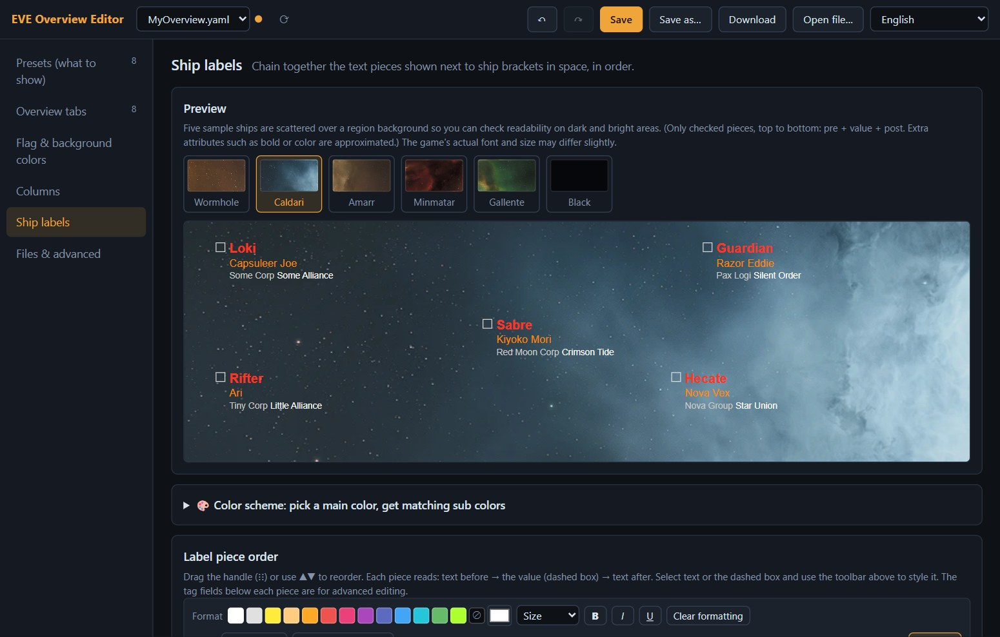

Setting up the EVE Online overview inside the game means digging through many tabs and very long lists. **EVE Overview Editor** lets you do it in your browser instead, with live previews: tick what to show, style your tab names, set flag and background colors, and check ship-label readability on real region backgrounds.

It works on the YAML file the game itself exports, so it never touches the game client. It runs on your own PC only and sends nothing to the internet.

> Unofficial, free, non-commercial fan tool. Not affiliated with CCP Games. See the [CCP notice](#ccp-notice).

[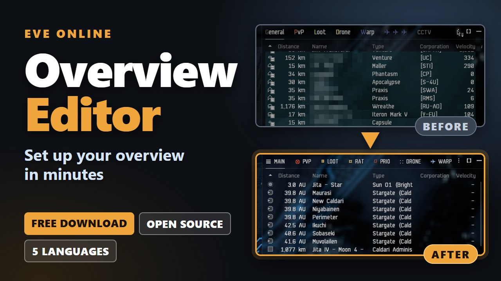](https://youtu.be/CwOz4BgNyzg)

▶ **[Video tutorial](https://youtu.be/CwOz4BgNyzg)** (4 minutes, English narration, subtitles in English, 한국어, 日本語, Русский and 中文).

## Contents

- [What you can do with it](#what-you-can-do-with-it)
- [Requirements](#requirements)
- [Install and start](#install-and-start)
- [Quick start: the whole workflow](#quick-start-the-whole-workflow)
- [Guide to every panel](#guide-to-every-panel)
- [Saving, backups and undo](#saving-backups-and-undo)
- [Recipes](#recipes)
- [Troubleshooting](#troubleshooting)
- [FAQ](#faq)
- [For developers](#for-developers)
- [CCP notice](#ccp-notice)

## What you can do with it

| Panel | What it edits |
|---|---|
| **Presets (what to show)** | Which object types (groups) and state filters an overview tab lists |
| **Overview tabs** | Tab names (with colors, size, bold / italic / underline and special characters), which preset each tab uses, per-tab columns |
| **Flag & background colors** | Priority, color and blinking of the small flag at the icon's bottom-right and of the row background |
| **Columns** | Which columns the overview shows, and in what order |
| **Ship labels** | The text pieces next to ship brackets in space, their order and styling, plus a color helper |
| **Files & advanced** | Overview folder, change summary, cleanup tools, backups, raw YAML |

Everything is safe to try: nothing is written until you press **Save**, every edit can be undone, and each save backs up the previous version first. Settings the editor doesn't know about are kept exactly as they were.

The interface is available in **English · 한국어 · 日本語 · Русский · 中文**. It follows your browser language, and you can change it with the language selector in the top bar.

## Requirements

- **Windows 10 / 11** for the ready-to-run downloads (a single `.exe`, or a zip). Both include their own copy of Node.js, so you do **not** need to install Node.js.
- On **macOS** or **Linux**, or if you would rather run the source code, you need **[Node.js](https://nodejs.org) 18 or newer** (the "LTS" download is fine). Only the `start.bat` launcher is Windows-only; elsewhere you start the server with one command.
- No `npm install`, and no internet connection while you use the editor.
- A current web browser (Chrome, Edge, Firefox, Safari).
- The EVE Online client, to export your settings and import them back.

## Install and start

### Option A: Windows, one file (recommended)

1. Open the [latest release](https://github.com/LanturnHouse/eve-overview-editor/releases/latest) and download **`EVE-Overview-Editor.exe`** (about 95 MB; it contains the editor and Node.js).
2. Put it in a folder of its own (for example `Documents\EVE-Overview-Editor`) and double-click it. A console window opens and your browser opens `http://localhost:5173`.
3. **Leave the console window open while you edit.** Close it to stop the editor.

The first time, Windows may say it "protected your PC" because the file is not code-signed. If you trust the download, choose **More info → Run anyway**. You can compare the file against `SHA256SUMS.txt` on the release page.

Your settings (the folder setting and the automatic backups) are kept in an `EVE-Overview-Editor-data` folder that the program creates next to the `.exe`. **Updating:** replace the `.exe` with the new one; the data folder stays.

### Option B: Windows, zip with `start.bat`

Prefer a folder over a single file? Download **`EVE-Overview-Editor-…-windows-x64.zip`** (about 40 MB) from the same release page, right-click it → **Extract All…** into a normal folder such as your Desktop or Documents (not *Program Files*), and double-click **`start.bat`**. A console window opens and, two seconds later, your browser opens `http://localhost:5173`. Leave the console window open while you edit; close it to stop.

Windows may show a security warning here too ("Windows protected your PC" or "Open File - Security Warning"); choose **More info → Run anyway** (or **Run**) if you trust the download. The bundled `runtime\node.exe` is the unmodified official Node.js.

**Updating:** extract the new version into a new folder. To keep your backups and the folder setting, copy `backups\` and `config.json` from the old folder into the new one.

### Option C: from the source code (any system, needs Node.js 18+)

1. **Install Node.js** from [nodejs.org](https://nodejs.org) (accept the defaults). To check it, open a terminal and run `node -v`; it should print `v18` or higher.
2. **Download the editor.** On the [GitHub page](https://github.com/LanturnHouse/eve-overview-editor), click the green **Code** button → **Download ZIP**, then unzip it anywhere (for example `C:\Tools\eve-overview-editor`). If you use git: `git clone https://github.com/LanturnHouse/eve-overview-editor.git`.
3. **Start it.**
   - **Windows:** double-click **`start.bat`** (the same launcher as in Option B; it uses your installed Node.js).
   - **macOS / Linux:** open a terminal in the folder and run `node server.mjs`, then open `http://localhost:5173` in your browser.
4. **Leave the console window open while you edit.** Close it (or press `Ctrl+C`) to stop the editor.

### Another port

To use another port, set `PORT` before starting, for example `PORT=5200 node server.mjs` (macOS / Linux), `set PORT=5200 && node server.mjs` (Windows Command Prompt) or `$env:PORT=5200; node server.mjs` (PowerShell). `start.bat` always opens port 5173, so open your own address by hand in that case.

With the single `.exe` (Option A), open a Command Prompt in its folder and run `set PORT=5200 && EVE-Overview-Editor.exe`. With the zip (Option B) there is no `node` on your PATH, so use the bundled runtime instead: `set PORT=5200 && runtime\node.exe server.mjs` in a Command Prompt opened in the extracted folder.

## Quick start: the whole workflow

The editor changes a **file**, not the running game. So the loop is: export from the game → edit in the editor → import back into the game.

### 1. Export your settings from the game

1. Open the menu of the Overview window (the **⋮** at its top-right) and choose **Open Overview Settings**. You can also use the shortcut you set under *Esc → Shortcuts → Window*.
2. In the Overview Settings window, open the **⋮ options menu** at the window's top-right and choose **Export Overview Settings**. Type a file name and press **Export**; the game then shows the path of the saved file. (Older guides describe Import / Export buttons at the bottom of the *Misc* tab; where they are depends on the client version.)
3. The game saves a `.yaml` file in `Documents\EVE\Overview` (Windows: `%userprofile%\Documents\EVE\Overview`, macOS: `~/Documents/EVE/Overview`).

### 2. Open it in the editor

The editor looks in that folder and opens a file automatically (it prefers `1.yaml`, otherwise the first file). If you have several, choose one in the drop-down at the top left. You can also drag any YAML file onto the window, or use **Open file…**.

If the folder can't be found, you'll see a notice. Set it in **Files & advanced → Change folder…** (that panel opens even when no file is loaded). Once the folder has files, the first one opens automatically.

### 3. Edit

Use the six panels in the list on the left. Changes appear in the previews immediately. An orange dot next to the file name means there are unsaved changes.

### 4. Save

Press **Save** (or `Ctrl+S`). The file in your overview folder is overwritten, and the previous version is copied to the `backups/` folder first. A message at the bottom shows the backup's name.

### 5. Import into the game

Open the Overview Settings window again, choose **Import Settings** from its **⋮ options menu**, pick the file you just saved and press **Import**. Your new tabs, colors and labels are applied right away. You don't need to restart the game.

> The game does not watch the folder. Your changes only reach the game when you import the file.

## Guide to every panel

### The top bar

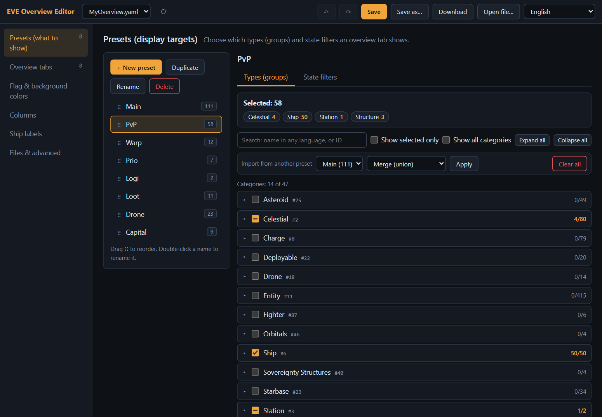

| Control | What it does |
|---|---|
| File drop-down | The YAML files in the overview folder. Switching asks before it discards unsaved changes. |
| ⟳ | Refresh the file list (for example after you export again from the game). |
| Orange dot | You have unsaved changes. |
| ↶ / ↷ | Undo / redo (`Ctrl+Z` / `Ctrl+Y`). About 200 steps. |
| **Save** | Write the open file into the overview folder (`Ctrl+S`). |
| **Save as…** | Write the current state under a new file name in the overview folder. |
| **Download** | Download the current state through your browser. Nothing is written to the overview folder. |
| **Open file…** | Open a YAML file from anywhere on your PC. (Saving still writes into the overview folder, under the same name.) |
| Language | Auto (browser), English, 한국어, 日本語, Русский, 中文. |

### Presets (what to show)

A **preset** is a saved list of *what an overview tab displays*: the object types (groups) and a few state filters. Every overview tab points to a preset for its list, and optionally to a preset for its space brackets (see *Display rules* under [Overview tabs](#overview-tabs)).

**Left side: the preset list.** The number on each preset is how many groups it contains.
- **+ New preset**, **Duplicate**, **Rename** (or double-click the name), **Delete**. Renaming also updates every tab that uses the preset. Deleting warns you if tabs still use it.
- Drag the **⋮⋮** handle to reorder presets.

**Types (groups) tab.** Pick what the preset shows.
- Tick single groups, or tick a whole **category** (the checkbox shows a dash when only some groups are selected). The chips at the top (for example `Ship 50`) summarize your selection; click one to jump to that category.
- **Search** by name in any of the five languages, or by group ID.
- **Show selected only**, **Expand all / Collapse all**. By default only the groups the game's own overview settings offer are listed. Groups that ESI knows about but the game does not list (ammo and scripts, regions, planetary structures, retired entries and so on) stay hidden, and so does any category that would be empty. A group your preset already contains is always shown, with an **unlisted** badge, so you can still untick it. Tick **Show unlisted groups** to see everything; the search box tells you when matches are hidden.
- **Import from another preset** combines another preset's groups into this one: *Merge (union)*, *Keep intersection only*, *Subtract (difference)* or *Replace completely*.
- **Clear all** removes every selection (you can undo it).
- *Unknown groups* are IDs that no longer exist in the game data. You can leave them or remove them.

**State filters tab.** For each pilot / object *state* (for example "At war with your corporation/alliance", "Excellent standing", "Criminal", "In your fleet") choose:
- **Default**: no special handling,
- **Hide**: objects with this state are hidden from the overview,
- **Always show**: shown regardless of the group selection.

A state can only be in one of the two lists; the editor warns you about conflicts. **Copy from another preset** and **Reset all to default** save time.

The state "Pilot has bounty on them" is left out of this list and of the flag and background lists, because the game can hide it depending on a server setting. If a preset (or the flag and background settings) already uses it, it is listed as usual, so nothing in your settings is lost.

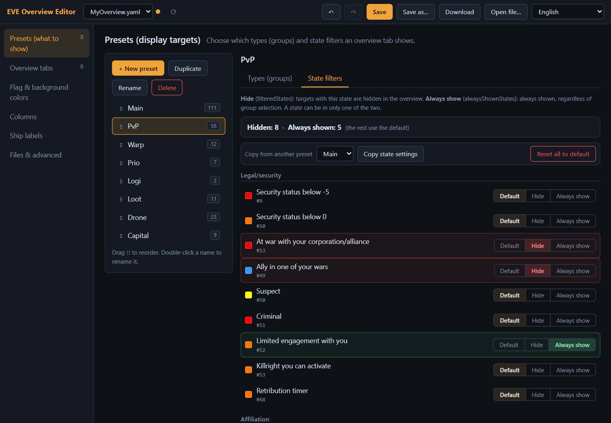

### Overview tabs

The tabs at the top of the in-game Overview window.

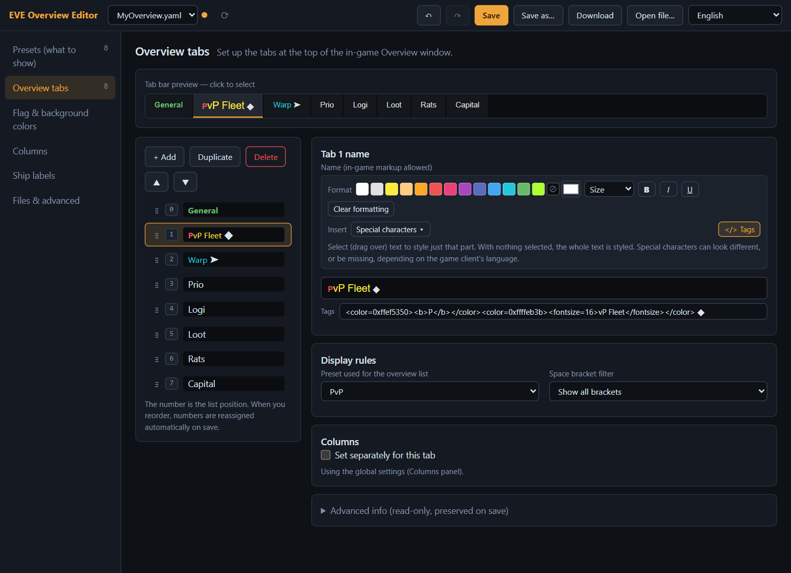

- The **tab bar preview** at the top shows your tab names with their styling. Click a tab to select it.
- **+ Add**, **Duplicate**, **Delete**, and **▲ ▼** (or drag **⋮⋮**) manage the list. The number is the tab's position in the game; numbers are reassigned automatically when you save.
- **Name.** Type in the box that shows your text *as it will look*. Use the toolbar above it:
  - color swatches (plus a color picker for any color, and a button to remove the color),
  - **Size**, **B** (bold), **I** (italic), **U** (underline), **Clear formatting**,
  - **Insert → Special characters**.
  - Select (drag over) part of the text to style only that part. With nothing selected, the whole name is styled.
- **Tags.** The small field below the name shows the real EVE markup the game stores, for example `<color=0xffef5350><b>P</b></color>`. It is for advanced users: if you edit it, the styled box above updates (and the other way around). Use the **`</> Tags`** button to show or hide it. Markup the editor doesn't understand is kept as it is.
- **Special characters.** The picker only lists characters that the EVE client fonts (EVE Sans Neue + Arial Unicode) can actually display, so you won't get empty boxes in the game. Choose a category (or *Recent*) and click a character to insert it at the cursor.

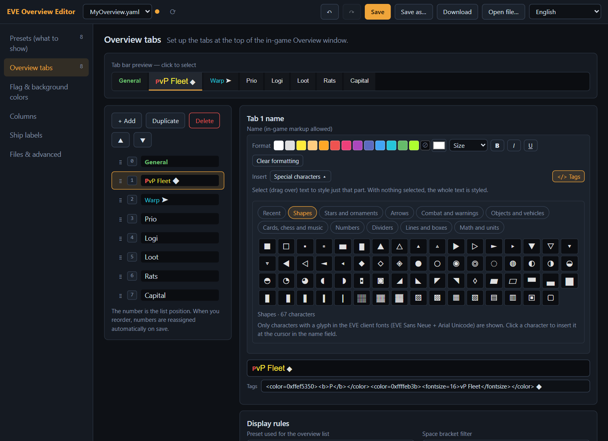

- **Display rules.** *Preset used for the overview list* decides what the tab lists. *Space bracket filter* decides which brackets show in space (*Show all brackets*, or a preset).
- **Columns.** Tick **Set separately for this tab** to give this tab its own column list. Otherwise it uses the global [Columns](#columns) settings.

### Flag & background colors

Each row in the overview can show a small colored **flag** at the bottom-right of its icon and a colored **background**. Both are driven by a prioritized list of *states* (at war, in your fleet, standing levels, criminal, suspect, and so on).

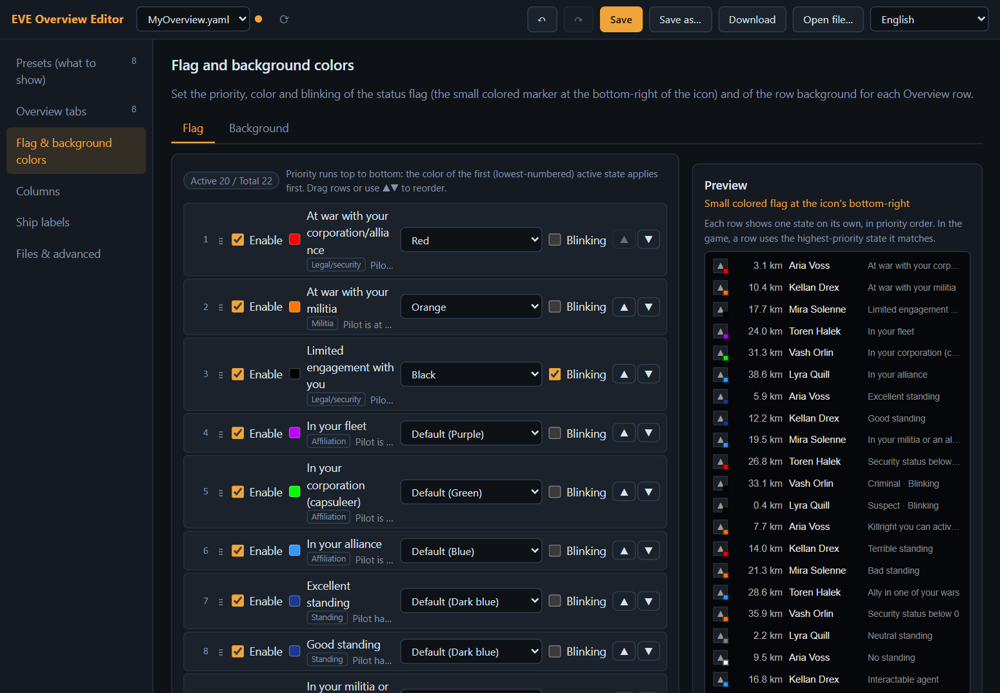

- Switch between **Flag** and **Background** with the tabs at the top.
- For each state: **Enable** it, pick a **color** (*Default* is the game's own color for that state), and tick **Blinking** if you want it to flash.
- **Order is priority.** The first enabled state that matches a row wins, so put the important states at the top. Drag the handle or use **▲ ▼**.
- The **Preview** on the right shows one row per state in priority order. The colors for named colors are close approximations of the in-game ones.

### Columns

Choose which columns the overview list shows and in what order.

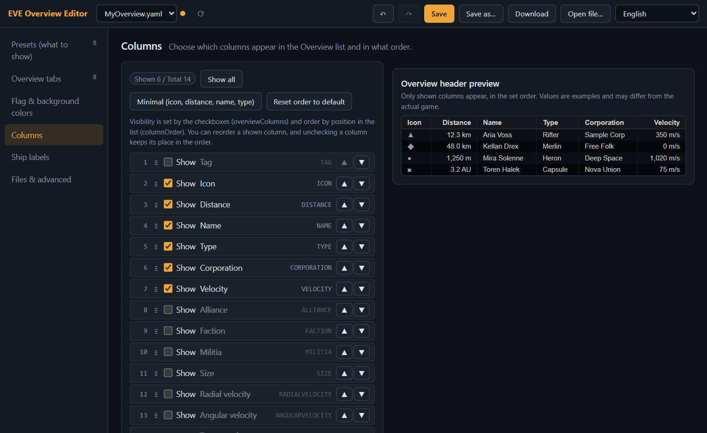

- Tick **Show** for each column you want; reorder with **▲ ▼** or by dragging. Unchecking a column keeps its place in the order.
- **Show all**, **Minimal** (icon, distance, name, type) and **Reset order to default** are one-click presets.
- The header preview on the right follows your choices. The values in it are only examples.
- These are the defaults for tabs that don't have their own column settings (set per-tab columns in *Overview tabs*).

### Ship labels

The text shown next to ship brackets in space, built from **pieces** such as *Pilot name*, *Ship type*, *Ship name*, *Corporation*, *Alliance*, *Faction* and *Militia*, plus an optional *separator*.

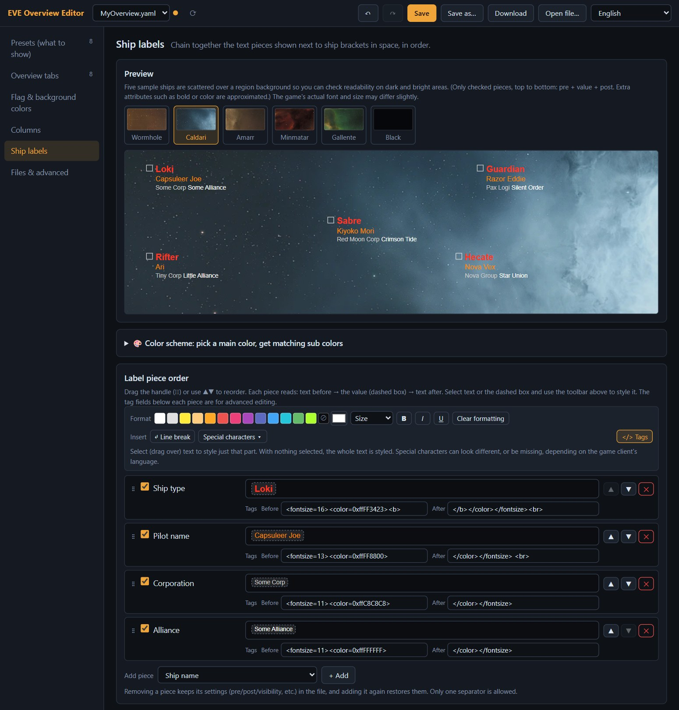

- **Preview.** Five sample ships on a real region background, so you can test readability on dark and bright areas. Switch between **Wormhole, Caldari, Amarr, Minmatar, Gallente** and **Black**.
- **Label piece order.** The checkbox shows or hides a piece; **▲ ▼** or the **⋮⋮** handle reorders; **✕** removes it from the list (its settings stay in the file, and adding the piece again restores them). Use **+ Add** at the bottom to add a piece.
- **Style each piece.** Every piece reads *text before → value → text after*. The value is the dashed box and stands for the real name or type that the game fills in. Click the dashed box and use the toolbar to style the value itself, or select the text before or after it. The same toolbar and **Tags** fields as in the tab names are available.
- **Line break** (in the toolbar) puts the next piece on a new line.

**Color scheme helper.** Don't want to pick every color by hand? Open **Color scheme: pick a main color, get matching sub colors**.

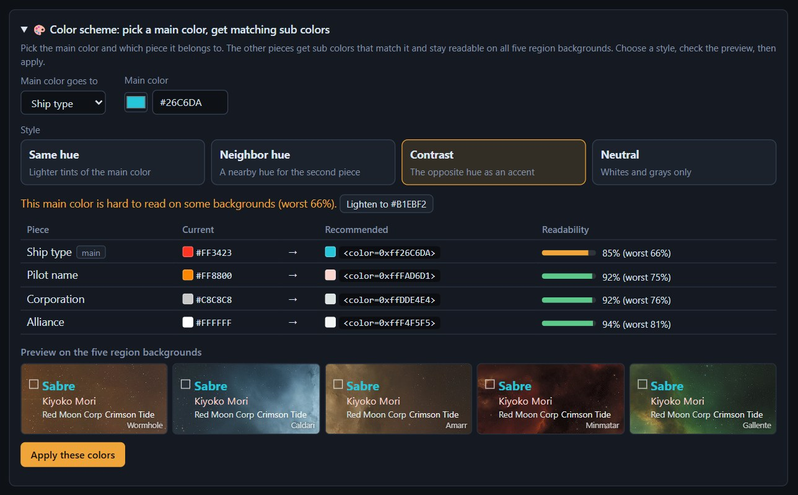

1. Choose which piece gets the **main color** and pick the color (or type a hex code). The helper works on *Ship type*, *Pilot name*, *Corporation* and *Alliance* and needs at least two of them in the label list; other pieces (Ship name, Faction, Militia) are left unchanged.
2. Choose a **style**: *Same hue* (lighter tints), *Neighbor hue*, *Contrast* (the opposite hue as an accent) or *Neutral* (whites and grays).
3. The table shows each piece's current color, the **recommended** color with its tag text, and its **readability**: the share of the five region backgrounds where the color reads clearly (contrast of at least 3), as average and worst case. If your main color is hard to read, a **Lighten to #…** button suggests a fix.
4. Check the small preview on the five backgrounds, then press **Apply these colors**. You can undo it.

### Files & advanced

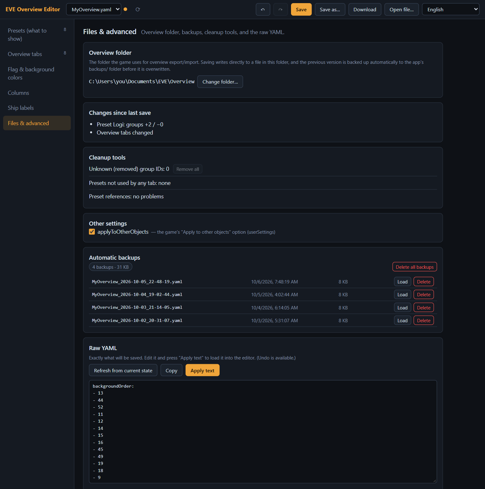

- **Overview folder.** The folder the game uses for export and import. **Change folder…** lets you enter another full path (the choice is remembered in `config.json` next to the server, or in `EVE-Overview-Editor-data` when you use the `.exe`).
- **Changes since last save.** A readable summary of what you have changed (presets, tabs, flags and backgrounds, columns, labels).
- **Cleanup tools.** Remove group IDs that no longer exist, and find presets that no tab uses or tabs that point to a preset that is missing.
- **Other settings.** The game's *Apply to other objects* option.
- **Automatic backups.** Every time a save overwrites a file, the previous version is stored here. **Load** opens a backup as a new, unsaved file (to restore it, use **Save as…** and type the original file name; the editor asks before overwriting), **Delete** removes one, **Delete all backups** clears the list.
- **Raw YAML.** Exactly the text that will be saved. You can edit it and press **Apply text**; mistakes are reported without changing anything.

## Saving, backups and undo

- **Nothing is written until you press Save.** Closing the browser tab with unsaved changes shows a warning.
- **Save** overwrites the open file in the overview folder. Before that, the old file is copied to `backups/<name>_<date>_<time>.yaml` in the editor's own folder (with the `.exe`: in `EVE-Overview-Editor-data\backups`). Backups pile up until you delete them in *Files & advanced*.
- **Save as…** writes under a file name you type (it asks before overwriting a different existing file; using the open file's own name is the same as Save). **Download** saves a copy through the browser instead.
- **Undo / redo** work across all panels (`Ctrl+Z` / `Ctrl+Y`, or the ↶ ↷ buttons). Inside plain text boxes such as the search field and the tag fields, the browser's own text undo is used.
- **Line endings:** when Save overwrites an existing file it keeps that file's line endings (CRLF stays CRLF); new files get CRLF on Windows; **Download** always produces LF. Everything the editor doesn't edit is written back unchanged.
- To go back to an older version, open **Files & advanced → Automatic backups → Load**, then use **Save as…** with the original file name.

## Recipes

**A tab for EWAR, interdiction and command ships**
1. *Presets* → **+ New preset** → name it `EWAR`.
2. On the **Types (groups)** tab, search and tick for example *Electronic Attack Ship*, *Force Recon Ship*, *Combat Recon Ship*, *Heavy Interdiction Cruiser*, *Interdictor*, *Command Ship* and *Command Destroyer*.
3. *Overview tabs* → **+ Add**. Type the tab name, color it, and insert a special character from the picker. Under **Display rules**, set *Preset used for the overview list* to `EWAR`.
4. **Save**, then import in the game.

**Make wars impossible to miss**
*Flag & background colors* → **Background** → *At war with your corporation/alliance* → **Enable**, color **Red**, tick **Blinking**, and move it to the top of the list.

**Readable ship labels everywhere**
*Ship labels* → open the color helper, set a bright **main color** for *Ship type*, choose a style, and check the readability column. Press **Apply these colors**, then confirm on each background in the preview.

**Share or move your setup**
Copy the `.yaml` file from the overview folder (or use **Download**) and import it on another PC or character.

## Troubleshooting

| Problem | What to do |
|---|---|
| `start.bat` says *Node.js is required* | You are running the source code, which needs Node.js. Either download the ready-to-run `.exe` or zip from the [Releases page](https://github.com/LanturnHouse/eve-overview-editor/releases/latest) (Option A or B), or install Node.js from [nodejs.org](https://nodejs.org), close the window and run `start.bat` again. |
| Windows says *Windows protected your PC* / *Open File - Security Warning* | The files are not code-signed. Choose **More info → Run anyway** (or **Run**) if you trust the download. |
| The console window of the `.exe` shows a message and closes | If the editor is already running, a second start just opens it in your browser again and closes after a few seconds. If something went wrong, the window stays for about 15 seconds so you can read the message. |
| *Port 5173 is already in use* | The editor is probably already running: open `http://localhost:5173`. Or start it on another port (see [Install and start](#install-and-start)). |
| The browser didn't open | Open `http://localhost:5173` yourself. |
| *Couldn't find the overview folder* | Export once from the game first, or go to **Files & advanced → Change folder…** and enter the full path, for example `C:\Users\you\Documents\EVE\Overview`. If your Documents folder lives on OneDrive, the editor tries that location too. |
| The file list shows *(no YAML files)* | There is no `.yaml` file in that folder yet. Export from the game, then press ⟳ (if no file is open yet, it opens the first one for you). |
| *This is not an EVE overview YAML file* | Use a file made by the game's **Export overview settings**. |
| The game doesn't show my changes | Press **Save** (no orange dot), then **import** the file in the game. The game never reads the folder by itself. |
| A character looks like an empty box in the game | Characters typed from your keyboard may not exist in the EVE fonts. Use the editor's special character picker, which only lists verified ones. |
| Colors in the preview differ a little | The previews approximate the game. Always check the real result in the game. |
| A saved file looks wrong | Restore the previous version from **Files & advanced → Automatic backups**. |

## FAQ

**Do I have to install Node.js?** Not with the Windows downloads from the [Releases page](https://github.com/LanturnHouse/eve-overview-editor/releases/latest): the `.exe` and the zip each carry their own copy of Node.js. You only need Node.js to run the source code, or on macOS / Linux. There is no installer either way: to remove the program, delete the `.exe` (and its `EVE-Overview-Editor-data` folder) or the extracted folder.

**Is it safe for my settings?** Yes. Saving always makes a backup first, unknown settings are preserved, and you can check the exact result in *Raw YAML* before saving.

**Does it change the game or talk to the game?** No. It only edits the YAML file that the game exports and imports. It never touches the client or its network traffic.

**Does it need the internet?** No. Everything it needs is in the file you downloaded. Group and category names come from the public ESI data, bundled in the app.

**Is my data sent anywhere?** No. The server listens on `127.0.0.1` only, refuses requests addressed to any other host name, and refuses changes (saving, deleting, changing the folder) that don't come from the editor page itself, so other websites can't modify your files. Nothing is sent to the internet.

**Does it work on macOS or Linux?** The server is plain Node.js, so yes: run `node server.mjs`. Only the `start.bat` launcher is Windows-only. The default overview folder is `~/Documents/EVE/Overview`; use *Change folder…* if yours is elsewhere.

**Which files does it read?** Overview exports in the current YAML format. Old XML exports are not supported; export again as YAML from the game.

**Can I edit several files?** Yes. Pick them in the file drop-down. Unsaved changes are never discarded without asking.

**Can I still use the in-game settings?** Of course. Export again to continue from the game's current state.

## For developers

- No build step and no dependencies: the server is `server.mjs`, the app is plain ES modules in `public/`. [js-yaml](https://github.com/nodeca/js-yaml) is bundled in `public/vendor/`.
- Translations live in `public/js/locales/` (English, Korean, Japanese, Russian, Chinese). Pull requests that improve them are welcome. The Japanese, Russian and Chinese state and column names are translations and may differ from the official in-game terms.
- `node tools/build-data.mjs` refreshes the group and category names from ESI (saved to `public/data/groups.json`).
- `node tools/build-overview-groups.mjs` refreshes `public/data/overview-groups.json`, the IDs of the groups the game's overview settings actually list. It reads the list that [Z-S Overview Customizer](https://github.com/Arziel1992/Z-S-Overview-Customizer) (AGPL-3.0) derived from an in-game "all entities" export; only the group IDs, which are game facts, are taken from it.
- `node tools/roundtrip.mjs <file>` reads and rewrites a file and tells you whether the result is identical to the original.
- `node tools/make-release.mjs` builds the Windows portable zip in `dist/`: the app, the Node.js runtime that is running the script (copied as `runtime\node.exe`), and a short guide.
- `node tools/make-exe.mjs` builds the single-file `dist/EVE-Overview-Editor.exe` with Node.js's [single executable applications](https://nodejs.org/api/single-executable-applications.html) feature (needs Node.js 22+; it fetches [postject](https://github.com/nodejs/postject) with `npx`), then starts it once as a smoke test. `server.mjs` detects that it runs from the exe and then serves `public/` from inside it and keeps its settings in `EVE-Overview-Editor-data` next to the exe.
- Pushing a tag such as `v1.0.0` runs `.github/workflows/release.yml`, which builds both files with the official Node.js and attaches them, plus `SHA256SUMS.txt`, to a GitHub Release.
- State ID names follow the public data of [kormat/eve-overview-tool](https://github.com/kormat/eve-overview-tool) and [Z-S Overview Customizer](https://github.com/Arziel1992/Z-S-Overview-Customizer). Colors shown for named colors are approximations of the in-game ones.

## CCP notice

This is an unofficial, free, non-commercial fan tool. This material is used with limited permission of CCP Games hf. No official affiliation or endorsement by CCP Games hf is stated or implied.

© 2014 CCP hf. All rights reserved. "EVE", "EVE Online", "CCP", and all related logos and images are trademarks or registered trademarks of CCP hf.

- The background images in `public/img/regions/` are EVE Online imagery owned by CCP hf. They are **not** covered by this repository's MIT license (source code only), and are used only for a free, non-commercial purpose (the ship-label readability preview) under CCP's content policy. They will be removed on CCP's request. The screenshots in `docs/img/` show the app, including these backgrounds, and the video thumbnail there contains EVE Online game footage, under the same terms.
- The code is MIT licensed. [js-yaml](https://github.com/nodeca/js-yaml) (MIT) is bundled in `public/vendor/`.
- The Windows zip contains the unmodified official [Node.js](https://nodejs.org) runtime (`runtime\node.exe`). The single `.exe` is built from the official Node.js runtime with the editor embedded and Node's code signature removed. Node.js is MIT licensed, with third-party components (<https://github.com/nodejs/node/blob/main/LICENSE>); the license text is attached to each release as `NODE-LICENSE.txt`.
